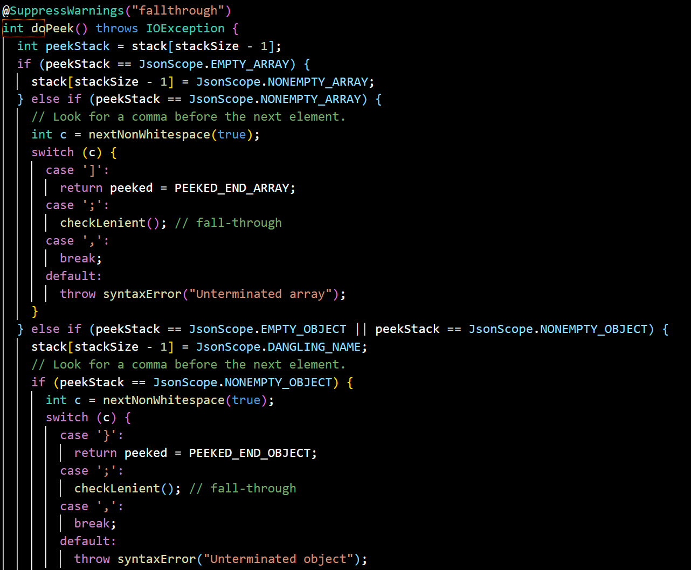
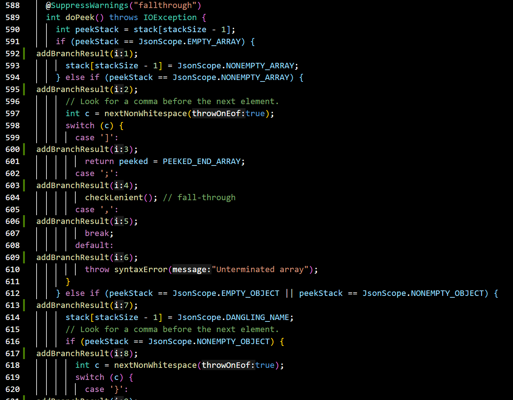
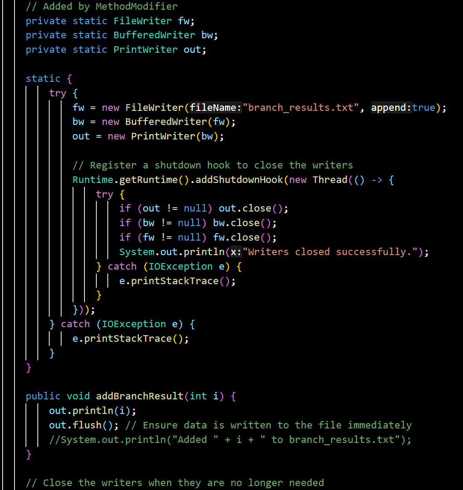
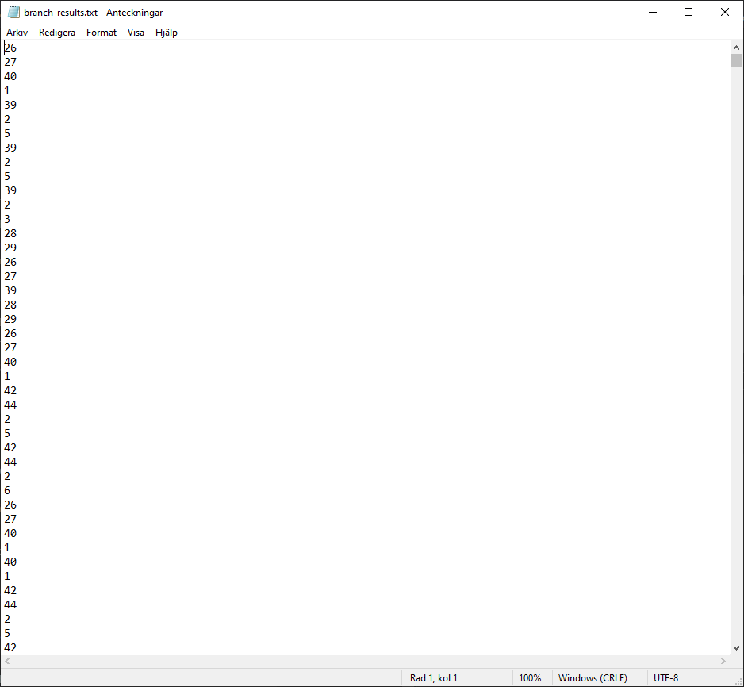
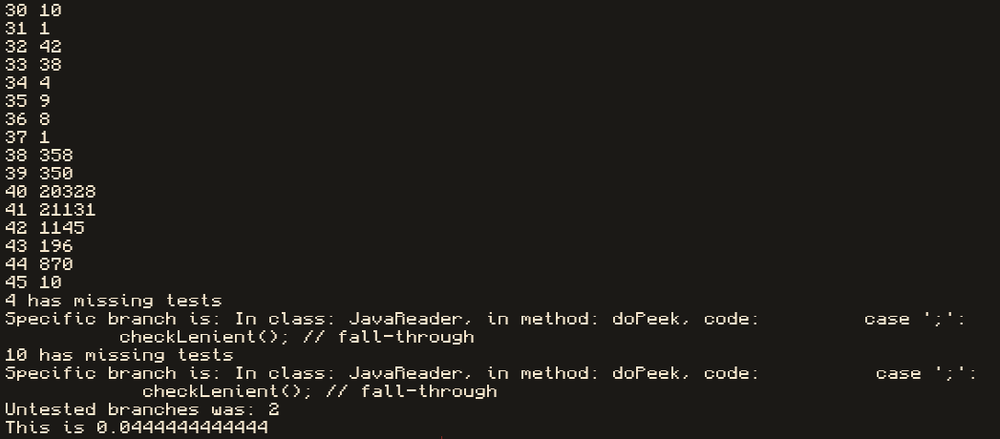
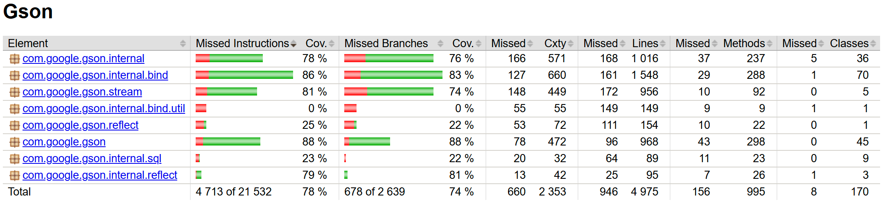
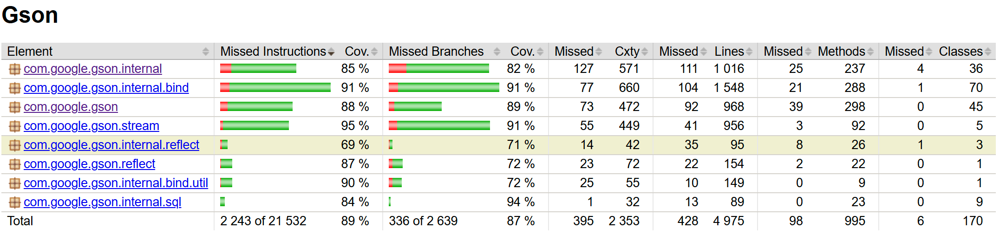
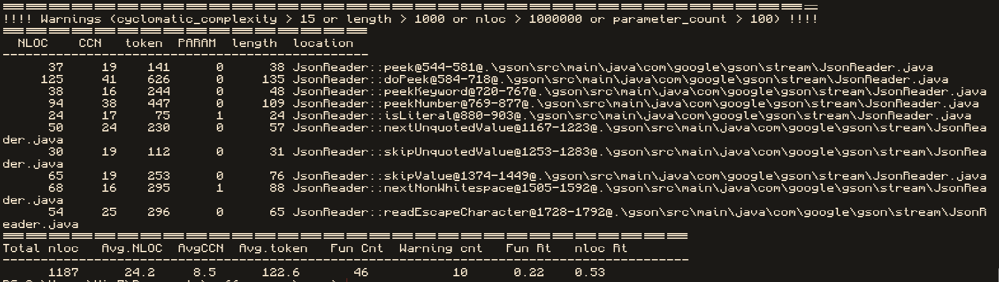
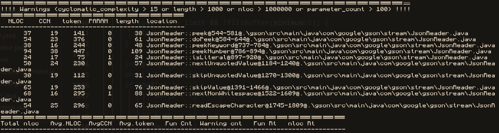

# Report for assignment 3

## Project

Name: GSON

URL: [https://github.com/google/gson](https://github.com/google/gson)

Gson is a Java library that can be used to convert Java Objects into their JSON representation. It can also be used to convert a JSON string to an equivalent Java object.

## Onboarding experience

### Did you have to install a lot of additional tools to build the software?

The only other software that was needed was ´maven´ (´mvn´). Most java devlopers should already have this though.

### Were those tools well documented?


Most tools are pretty well documented. There is a lot of javadoc about how to use the tools that GSON provides. 

However, most other things like settings, ´pom´ files and structure of files have been much harder to work with. For example, the ´pom´ files make it so that all ´warnings´ are treated as ´errors´. This made the manual DIY-ing very hard.

### Were other components installed automatically by the build script?

Yes since maven is used a lot of other dependencies are downloaded.

### Did the build conclude automatically without errors?

If you ran the project with `mvn clean verify` it did, however ´mvn clean test´ did not work. 

### How well do examples and tests run on your system(s)?

It can be quite hard to get everything to work. A lot of things had to be removed from different `pom` files or ´config´ files, however, when this is done it runs pretty good.

However, since there are ´122´ tests files (and over 4000 tests) compiling goes pretty slow.

## Cyclomatic complexity

### Complexity
Cyclomatic complexity is essentially a was to analyze and quantify a programs control flow. For example if the code contains no control flow statements, the cyclomatic complexity would be 1. Thus a way to define cyclomatic complexity is to create a control flow graph with the “blocks” in the program as nodes with directed edges between them if control can flow from one to the other. Cyclomatic complexity is then M = E-N + 2P, where E is edges in the graph, N is nodes in the graph and P are number of connected components.


1. What are your results for five complex functions?
   * Did all methods (tools vs. manual count) get the same result?
   * Are the results clear?

We choose five methods from the gson/src directory:
read(JsonReader in)
.\gson\src\main\java\com\google\gson\internal\bind\JsonElementTypeAdapter.java
parse(String date, ParsePosition pos)
File path: .\gson\src\main\java\com\google\gson\internal\bind\util\ISO8601Utils.java 
doPeek()
.\gson\src\main\java\com\google\gson\stream\JsonReader.java
peekKeyword()
.\gson\src\main\java\com\google\gson\stream\JsonReader.java
skipValue()
.\gson\src\main\java\com\google\gson\stream\JsonReader.java

#### Decision points
if
else if
for
while
switch
catch
Logical operators (&&, ||)

#### READ
User 1:
Loc: 45
CC: 11
Manual CC: 13
User 2:
Loc: 45
CC: 11
Manual CC: 13
Conclusion: No difference found, clear results.
Decision points (line numbers):
if: 79, 88, 98, 106, 110, 116, 123, 129.
else if: 112, 125, 131.
for:
while: 94, 95.
switch:
catch:
&&:
||:


#### PARSE
User 1:
Loc: 117
CC: 30
Manual CC: 30
User 2:
Loc: 117
CC: 30
Manual CC: 30
Conclusion: No difference found, clear results.
Decision points (line numbers):
If-statements:   154, 160, 178 186, 190, 195, 199, 203, 207, 230, 237, 249, 262, 269, 302
Else/Else-if: 240, 251, 278
For:
While:
Switch-cases: 214, 217
Catch: 297
Logical operators (&&, ||): 178, 201, 203, 240, 249, 303

#### doPeek
User 1:
Loc: 125
CC: 41
Manual CC: 44
User 2:
Loc: 125
CC: 41
Manual CC: 44
Conclusion: No difference found, clear results.
Decision points (line numbers):
if: 3, 21, 42, 50, 65, 73, 79, 92, 99, 120, 125, 129.
else if: 5, 18, 44, 52, 56, 72, 77, 81, 85, 103.
for: 
while: 
switch: 8, 23, 35, 60, 90.
catch: 
&&: 65.
||: 18, 65, 99.

#### peekKeyword
User 1:
Loc: 38
CC: 16
Manual CC:  17
User 2:
Loc: 38
CC: 16
Manual CC: 17
Conclusion: No difference found, clear results.

Decision points (line numbers):
If-statements:   728, 750, 755, 760
Else/Else-if: 732, 736, 740
For: 749, 
While:
Switch-cases:
Catch:
Logical operators (&&, ||): 728, 732, 736, 750, 754, 760

#### skipValue
User 1:
Loc: 65
CC: 19
Manual CC:  18
User 2:
Loc: 65
CC: 19
Manual CC: 18
Conclusion: No difference found, clear results.

Decision points (line numbers):
If-statements:    1378, 1398, 1417, 1424, 1431
Else/Else-if: 
For:
do/While: 1376
Switch-cases: 1383, 1387, 1391, 1395, 1405, 1408, 1411, 1414, 1421, 1428, 1435, 1438, 
Catch:
Logical operators (&&, ||): 


2. Are the functions just complex, or also long?
Generally the functions with higher CC have more lines of code. So generally they are not just complex but also long. However read() and peekKeyword() are exceptions to this, since peekKeyword() is shorter than read() but has higher CC.

3. What is the purpose of the functions?
##### READ
Reads a JSON structure from a JsonReader and converts it into a JsonElement. It also handles nested JSON elements using a stack. It optimizes this by using JsonTreeReader.

##### PARSE
Parses a date string into a Date object. It handles edge cases such as leap seconds, incomplete time zones and input validation. 

##### DOPEEK
Examines the next token in the input stream which allows the parser to determine what type the next coming JSON element is. It can handle various JSON structures and syntax rules for formats that are non standard for JSON. 

##### PEEKKEYWORD
This function checks if the current position in the buffer matches a JSON keyword like true, false or null. It also handles case sensitivity based on how something is parsed, strict vs lenient. If a match is found and it is followed by a non-literal character the method moves the buffer position and returns a constant. 

##### SKIPVALUE
Skips over a JSON value without parsing the content. Maintains the internal state of the JSON parser by updating stack levels and path indices. 

4. Are exceptions taken into account in the given measurements?
Yes, we have counted catch statements in our CC measurements. However, lizard does not take catch statements into account, hence the lizard CC being slightly lower than the manual CC for some methods.

5. Is the documentation clear w.r.t. all the possible outcomes?
No, Some functions does not have any clear documentation and are missing Javadoc. For example, read(), peekKeyword(), doPeek() all are missing javadoc documentation. They only contain simple one-line comments in some places of the code. 


### Refactor into smaller functions (decrease complexity)
#### Refactoring
Plan for refactoring complex code:

##### READ
For the read method it is possible to break the method into 4 separate methods.
JsonElement tryBeginNesting(JsonReader in, JsonToken peeked)
Checks if the current JsonToken points to the beginning of a nested JSON structure. If it does, it will initiate the corresponding nesting.

JsonElement readTerminal(JsonReader in, JsonToken peeked)
This method would read a terminal value from the JSON and map the JsonToken to the corresponding JsonElement.

void processValue(JsonElement current, String name, JsonElement value)
This method would add the parsed value to the current JSON container. If it is a JsonArray, it is added as a named member using the name. 

JsonElement getNextValue(JsonReader in, JsonToken peeked)
This method would determine the next value to be processed by either starting a new nesting structure or reading a terminal value. It would centralize the token selection process which would improve readability and maintainability. 

##### PARSE
In order to refactor this code, we can extract the extractYear, extractMonth and extractDay methods. This would reduce the repetition in the code and make it easier to maintain. 
Extracting the hasTimeComponent would also improve readability. Same goes for extractTime method, which would create a reduced nesting level in the main method. Extracting extractTimeZone method would also make the parsing flow cleaner. Finally extracting the createCalendar and handleParseExecution methods would greatly improve core maintainability and repetitive behaviours. 

##### #DOPEEK
Refactoring this method would include extracting a range of helper methods. This includes:
void handleEmptyArray()
void handleNonEmptyArray()
void handleEmptyOrNonEmptyObject(int peekStack)
void handleDanglingName()
void handleEmptyDocument()
void handleNonEmptyDocument()
int handleDefaultCases(int peekStack, int c)

This would reduce the size of the doPeek() method and would make the code easier to maintain. The readability would also become much better. 

##### PEEKKEYWORD
In order to refactor this method, we would firstly have to extract the helper methods. This would include separating the keyword matching logic into individual helper methods. We could also introduce an enum, which would allow us to eliminate repressive if-else conditions. Finally, we could also move the check logic into a separate method, for instance: (boolean isInvalidLiteral(int length)).

##### SKIPVALUE
To refactor this code, we can extract help methods. We could break the switch cases into help methods such as handleBeginArray(), handleBeginObject(), handleEndArray(), handleEndObject(), and handleQuotedOrUnquotedName(). This would isolate the responsibilities of each code part and reduce cyclomatic complexity in the main method. We could also remove the duplicate logic by creating an updatingPathNames() method that can be used in multiple instances in the code to update path names. This would greatly reduce repetition in the code. 


Generally one can refactor the code by splitting the “subfunctionality” into separate functions, this would make the code much easier to read and understand. However it could also come with negative effects in terms of how easy it is to read. Refactoring the code into helper functions will require a lot more “jumping about” to read the code. Also one should consider whether it is worth refactoring the helper functions if the functions are only used in 1 or very few places. 


Estimated impact of refactoring (lower CC, but other drawbacks?).
Refactoring would result in better code readability and structure. It would also promote a more collaborative environment through better code structure. Creating help methods would lower CC as each method would be smaller, hence less decision points in general. However, creating more methods also creates longer classes with more code. To conclude the result of refactoring, lower CC leads to higher Loc. 


## Coverage

### Ad-hoc coverage-tool

An ad-hoc coverage tool was implemented. Found here in src.

This tool is very simple, both in functionality and use.

#### Building

Simply run in the `src` directory: 

```bash
javac *.java
```

#### Running

```
java MethodModifier <classname>-<method>:<method> <classname>-<method>:<method>
```

When the code runs it starts with the first method in the first class.


##### Example of modified ´doPeek()´

When running the program one can for example exhibit the following behaviour in the ´doPeek´ method in the ´JsonReader´ class.

Before the code is modified the function will look something like:


First the method will be updated to look something like:


Then the static fields and functions will be imported:


###### Compilation

Now all of the code will be compiled, and then tested with ´mvn clean verify´

Then when the relevant methods are called during the testing, the textfile will be populated. It can for example look like the following:



###### Reading results

After ´mvn´ have finished running the changed files are reverted to their original form, and the ´temp´ file is removed.

After this the program will go through the text file and check all the times a branch was accessed. Then it will output all branches that are not tested during the tests.

This can look like the following:



#### Functionality

The java program automatically injects code at places where the code may branch. This is for example ´if´, ´else´ and ´switch´ statements. But also places like ´for´ and ´while´. Each of these places will get an unique ´ID´ (for this run). If the relevant branch is ran in execution, then the injected code will also add that ´ID´ to a ´txt´ file.

After all tests are done, the program can simply go through the entire file and check if there is any ID that does not appear in the ´txt´ file. If this is the case then that branch has not been tested. This then prints the relevant branching instruction. 

#### Where does it miss

This does not check all possible branches. For example if there is a ´if´ statement that returns, it is not checked if the code after this statement is also reached. Which can be good. This is a simple fix, we simply have to tell where the ´if´ statement ends and add another check there.

It also does not check for ternary operations or for thrown `errors`.


## Coverage improvement

The coverage between our new tests was:



The coverage after our new tests was:



Where we can see that there has been an significant increase in the code and branch coverage!

### Hanna
I have analyzed the function parse(), found @./gson/src/main/java/com/google/gson/internal/bind/util/ISO8601Utils.

Analyzed with my own coverage tool, the test cases visits 11 out of 22 possible branches. This corresponds to a branch coverage of 50%. Three tests were added to the unit tests for the function, testDateParseInvalidTimezone(), testDateParseMismatchedTimezone() and testDateParseLeapSecondWithMilliseconds(). With the new tests a total of 17 branched was visited, which gives a coverage of 77%.

## Self assessment
We have been working together for a few weeks and have established a solid way of working, meeting all the criteria for the In Place stage. The entire team actively uses our agreed practices and tools. We primarily use Slack for communication and a GitHub repository to store and collaborate on code, as agreed from the start. We use GitHub Issues and continuous commits to coordinate smoothly.

Our meeting structure supports both independent work and team discussions when needed. We have a mix of scheduled meetings and short notice check-ins, which has worked well. As a result, our way of working meets most of the Working Well criteria. Overall, we are very satisfied with our workflow. Moving forward, we aim to further integrate and streamline our processes. In previous tasks, we successfully used our tools and continuously integrated our work into GitHub. However, due to the short time frame, this task was more challenging, and we aim to furter improve our usage of some tools, such as github issues, for the next assignment.


### Improvement on Cyclomatic complexity

The cyclomatic complexity of the `doPeek()` was previously:



After improvements this became: 


